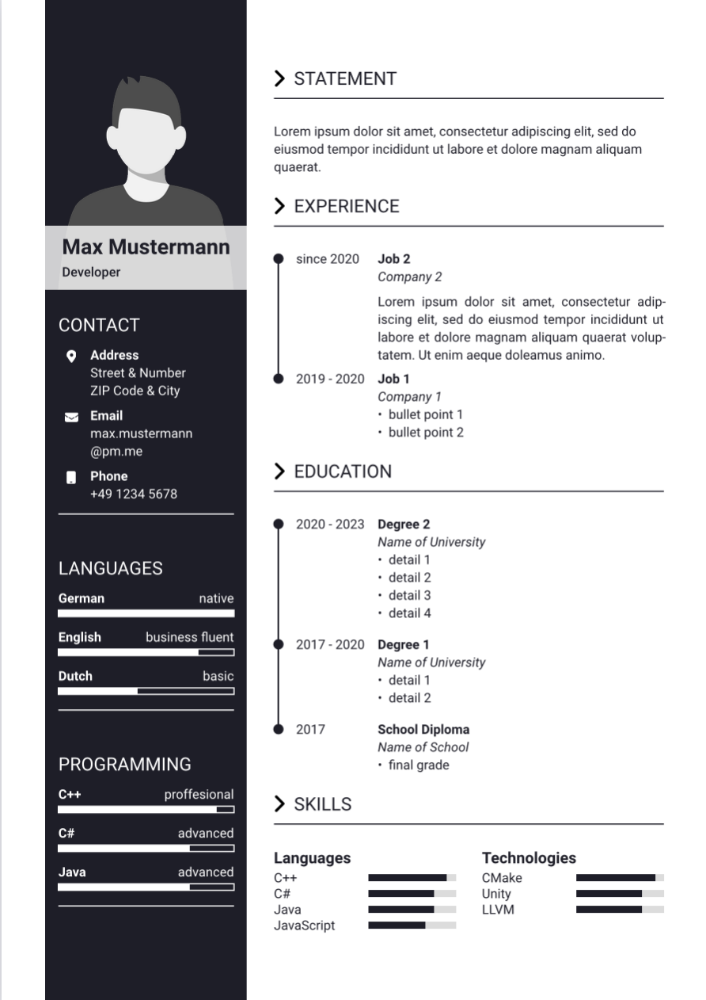

# Typst Resume Template
---

A simple resume template for [typst](https://github.com/typst/typst).

|  |  |  |
| --- | --- | --- |
| [example 1](example-1.typ) | [example 2](example-2.typ) | [example 3](example-3.typ) |

## Getting Started

First clone or download this repository. Then either:
- Upload the files in this repository into a project inside the online [typst app](https://typst.app/) (without the `preview` folder).
- Install typst on your local machine as described [here](https://github.com/typst/typst#install-and-use). Afterwards, you have to invoke typst to convert a `.typ` file to pdf, e.g. like so: `typst example-1.typ`
- Open the repository in VS Code and install the [typst-lsp](https://github.com/nvarner/typst-lsp) extension.

When using typst locally, you need to ensure that the fonts used in your document are installed on your machine. The default font used in this template is [*Roboto*](https://fonts.google.com/specimen/Roboto), but you can easily change that.

## Customizing

Have a look at the examples to see what the template offers and how to use it.

If you want to whip up a quick resume, you can take the example that suits you best and just change the data.

If you need special formatting or want to dig deeper, have a look at [resume.typ](resume.typ). It is littered with comments that hopefully make sense of the mess :-)

## Known Issues

- Transparency of the name box seems to work in the online preview, but is not present in the final pdf

## Acknowledgements

The design is based on a resume I found [here](https://lebenslauf.netlify.app/max-mustermann-lebenslauf.html).

The inner workings are heavily inspired by the official *Department News* template found in the typst app.

## Licensing

This project is licensed under the [Apache 2.0 license](LICENSE), with the these exceptions:
- The following icons are taken from [*Font Awesome Free*](https://github.com/FortAwesome/Font-Awesome) and are licensed under the [CC BY 4.0 License](https://fontawesome.com/license/free):
    - [angle-right-solid.svg](angle-right-solid.svg)
    - [envelope-solid-white.svg](envelope-solid-white.svg)
    - [location-dot-solid-white.svg](location-dot-solid-white.svg)
    - [mobile-solid-white.svg](mobile-solid-white.svg)
    - [phone-solid-white.svg](phone-solid-white.svg)
- The following images were created by me and are licensed under the [CC BY 4.0 License](https://creativecommons.org/licenses/by/4.0/):
    - [user-banner.png](user-banner.png)
    - [user.png](user.png)
